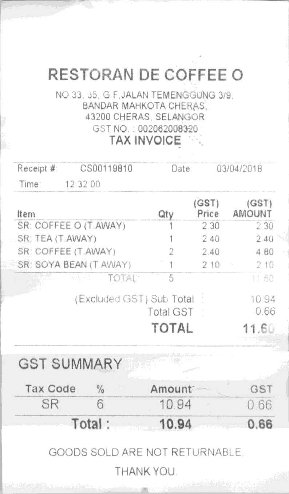
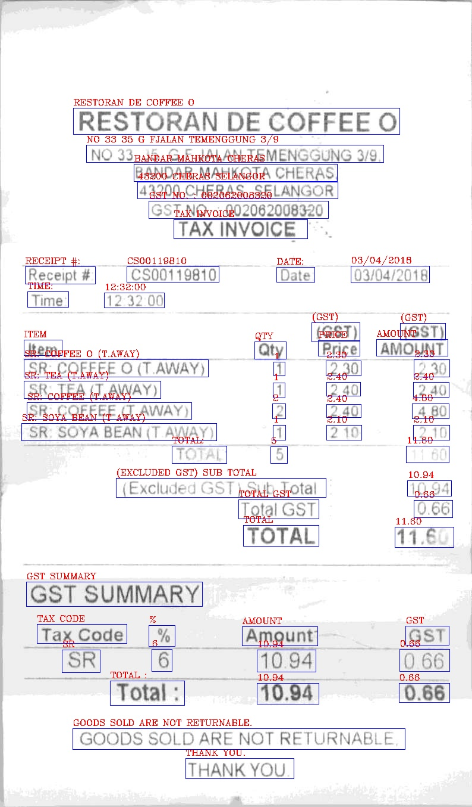

# ICDAR 2019 Robust Reading Challenge on Scanned Receipts OCR

## Background
這個專案是使用ICDAR 2019 SROIE的資料集,用YOLOv5做文字檢測,接著用CRNN做文字預測

### Dataset
**資料集網址:** https://rrc.cvc.uab.es/?ch=13&com=introduction

範例圖片如下顯示：
<div align=center></div>

### Tasks
這個專案會分成3個Tasks:

1. 訓練文字預測模型(CRNN)

2. 訓練文字檢測模型(YOLOv5)

3. 結合Task1的CRNN和Task2的YOLOv5,整合出inference流程

## Usage Guide
### Task1
#### Step1 - 產生訓練資料
將ICDAR2019原始train data進行前處理
```bash
python create_data.py --save_dir data_train --jpg_dir "../SROIE2019/0325updated.task1train(626p)/" --txt_dir "../SROIE2019/0325updated.task1train(626p)/"
```
將ICDAR2019原始test data進行前處理
```bash
python create_data.py --save_dir data_test --jpg_dir "../SROIE2019/task1_2_test(361p)/" --txt_dir "../SROIE2019/text_task1_2_test(361p)/" 
```
#### Step2 - 訓練CRNN模型
使用data_train、data_test來訓練CRNN model, 並存模型在checkpoints dir
```bash
python train.py --train_dir data_train --test_dir data_test --save_dir checkpoints
```
#### Step3 - 對test data計算accuracy
使用訓練好的CRNN對data_test做預測, 計算accuracy
```bash
python predict.py --test_dir data_test --model_path ./checkpoints/crnn_epoch100_testloss0.021956.pt
```

### Task2
#### Step1 - 產生訓練資料
將ICDAR2019 train data轉換成YOLO格式
```bash
python icdar2019_to_yolo.py --icdar_dir "../SROIE2019/0325updated.task1train(626p)" --image_dir datasets/ocr/images/train2017 --label_dir datasets/ocr/labels/train2017
    """
```
#### Step2 - 訓練YOLOv5s6模型
使用YOLOv5s6訓練文字檢測模型
```bash
python train.py --data icdar2019.yaml --weights yolov5s6.pt --img 1280 --epochs 500 --hyp hyp.scratch-low.yaml
```

### Task3
#### Step1 - 文字檢測 + 文字預測
將Task2的YOLOv5s6 + Task1的CRNN做inference
```bash
python inference.py --nosave --save-txt --conf-thres {conf-thres} --iou-thres {iou-thres} --weights {YOLOv5_path} --source {image_path}
```

## Results
<table>
  <tr>
    <td valign="top"></td>
    <td valign="top"></td>
  </tr>
</table>

